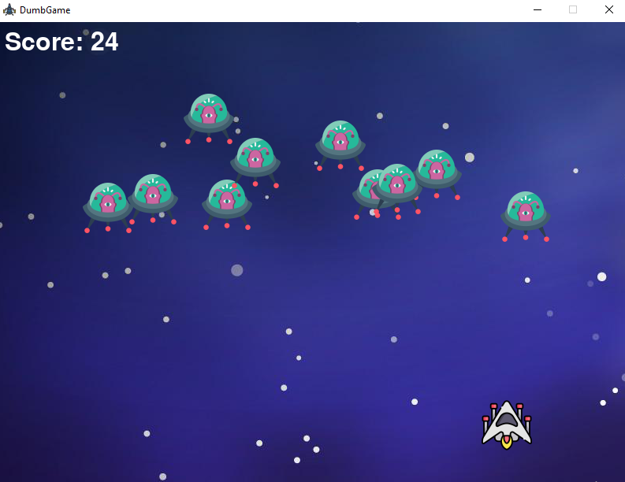

## SpaceInvaderGame<hr> 

#### Pygame Mini Project <hr>
##### Install the pygame module in your machine
`pip install pygame`
<br>

``` python

# importing necessary packages 
import pygame
import time
from pygame import mixer
import math

#initialize the window using pygame.init()
pygame.init()

```
<hr>

## Beginner Friendly Pygame Project  
### Classic SpaceInvaderGame where the main goal is to defeat the respawning enemies using bullets  
<hr>


